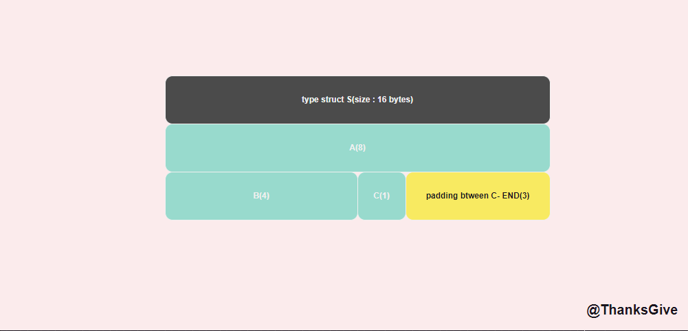

# 对齐方式

对齐（Alignment）是指数据在内存中的存储位置必须满足某些特定的对齐要求。通常，这些对齐要求时为了优化内存访问速度 和 提高系统性能。

### 为什么要实施对齐呢？
* 1、硬件要求：某些硬件架构要求特定类型的数据必须存储在特定的地址上，否则可能会发生异常；
* 2、性能考虑：对齐数据可以使处理器以更高效的方式访问内存。例如：未对齐的数据可能需要进行多次内存访问，而对齐的数据则可以一次性读取。
* 3、内存分析：了解字段 和 数据结构的对齐方式，能够帮助我们了解底层内存的计算方式，以便设计出更加优秀的存储结构，进而优化其内存大小；
### 对齐的基本规则：
* 1、自然对齐：对于一个基本类型，其对齐边界通常等于其字节大小。例如，一个 int32 类型变量通常要求 4 字节对齐；
* 2、数据结构对齐：结构体中的每个字段也需要对齐，以确保每个字段都能在合适的地址上开始；

## Go 中类型对齐方式的处理

### 一、对于一个基本类型，其对齐边界通常等于其字节大小 

```go
// 利用 unsafe.Alignof : 获取 类型 或 变量 的对齐方式
func main() {
	var b bool
	var i int
	var f float64
	fmt.Println("alignment of bool :", unsafe.Alignof(b)) // 通常是：1
	fmt.Println("alignment of int :", unsafe.Alignof(i)) // 根据系统位数判定，32位是: 4, 64位是: 8
	fmt.Println("alignment of float64 :", unsafe.Alignof(f)) // 通常是：8
}
/* 
alignment of bool : 1
alignment of int : 8
alignment of float64 : 8
*/
```
### 二、结构体的对齐方式

结构体存在字段排列顺序，[ 其结构体最终的字节大小取决于不同的排列顺序，因为不同的排序可能产生不同的对齐方式 ]，[ 而Go 编译器是不会自动调整结构体的字段顺序的 ]，需要这里就需要开发者自行思考

结构体的对齐遵循以下规则：
* 1、**以其最大对齐要求为准来对齐的；**
* 2、**每个字段都要对齐自身类型所需的字节边界；**
* 3、**整个结构体的大小必须是其最大对齐要求的倍数；**

白话终究是徒劳，让我们实践见真章！Go 🏎️🏎️🏎️

先看一个 struct 对齐方式的代码实例
```go
// size of S : 24 bytes
type S struct {
	A bool
	B float64
	C int32
}

func main() {
	var s S
	// 获取结构体大小
	size := unsafe.Sizeof(s)
	fmt.Printf("size of s: %d bytes\n", size)

	// 获取字段对齐要求
	alignA := unsafe.Alignof(s.A)
	alignB := unsafe.Alignof(s.B)
	alignC := unsafe.Alignof(s.C)

	// 获取字段类型
	typeA := reflect.TypeOf(s.A)
	typeB := reflect.TypeOf(s.B)
	typeC := reflect.TypeOf(s.C)

	fmt.Printf("Alignment %s of A - : %d bytes\n", typeA.Name(), alignA)
	fmt.Printf("Alignment %s of B - : %d bytes\n", typeB.Name(), alignB)
	fmt.Printf("Alignment %s of C - : %d bytes\n", typeC.Name(), alignC)

	// 获取字段偏移量
	offsetA := unsafe.Offsetof(s.A)
	offsetB := unsafe.Offsetof(s.B)
	offsetC := unsafe.Offsetof(s.C)
	fmt.Printf("Offset of A : %d bytes\n", offsetA)
	fmt.Printf("Offset of B : %d bytes\n", offsetB)
	fmt.Printf("Offset of C : %d bytes\n", offsetC)

	// 计算填充量
	paddingAB := offsetB - (offsetA + unsafe.Sizeof(s.A))
	paddingBC := offsetC - (offsetB + unsafe.Sizeof(s.B))
	totalPadding := size - (unsafe.Sizeof(s.A) + unsafe.Sizeof(s.B) + unsafe.Sizeof(s.C))

	fmt.Printf("Padding between A and B: %d bytes\n", paddingAB)
	fmt.Printf("Padding between B and C: %d bytes\n", paddingBC)
	fmt.Printf("Padding between C and END: %d bytes\n", totalPadding-paddingAB-paddingBC)
	fmt.Printf("Total padding in struct: %d bytes\n", totalPadding)
	fmt.Printf("Padding between A and B: %d bytes\n", paddingAB)

	// 打印内存地址(转化为 十进制，方便计算)
	fmt.Printf("S -> A: %d, B: %d, C: %d\n", &s.A, &s.B, &s.C)
}
/* 
size of s: 24 bytes
Alignment bool of A - : 1 bytes
Alignment float64 of B - : 8 bytes
Alignment int32 of C - : 4 bytes
Offset of A : 0 bytes
Offset of B : 8 bytes
Offset of C : 16 bytes
Padding between A and B: 7 bytes
Padding between B and C: 0 bytes
Padding between C and END: 4 bytes
Total padding in struct: 11 bytes
Padding between A and B: 7 bytes
S -> A: 824633835808, B: 824633835816, C: 824633835824
*/
```
根据上述的打印结果，请试着推算一下 上述结构体的内存中的字节布局

* 从 [ S -> A: 824633835808, B: 824633835816, C: 824633835824 ] 我们可以知晓结构体中三个字段的内存开始地址
* A 从 808 位置开始，B 从 816 位置开始，说明 A - B 之间是 8 个字节，A 自己占 1 个字节，说明填充了 7 个字节，也侧面证实了填充的打印结果[Padding between A and B: 7 bytes]  
* 类推 B 到 C 的位置，C 从 824 位置开始，说明 B - C 之间也是 8 个字节，而 B 自己占 8 个字节，证明 [Padding between B and C: 0 bytes] 的正确性。
* C 自己占 4 个字节 加上 [Padding between C and END: 4 bytes] 填充的 4 个字节

可以推出字节布局为：

**1(A) + 7(padding A-B) + 8(B) + 4(C) + 4(padding C-END) ---> 24 bytes**


---

而这 是否就是 当前结构体的最佳内存大小容量呢？让我们试着调整一下 struct 中的字段排序规则如下试试：
```go
type S struct {
	A float64
	B int32
	C bool
}
// 替换为这个 struct 后，重新运行一下
/* 
size of s: 16 bytes
Alignment float64 of A - : 8 bytes
Alignment int32 of B - : 4 bytes
Alignment bool of C - : 1 bytes
Offset of A : 0 bytes
Offset of B : 8 bytes
Offset of C : 12 bytes
Padding between A and B: 0 bytes
Padding between B and C: 0 bytes
Padding between C and END: 3 bytes
Total padding in struct: 3 bytes
Padding between A and B: 0 bytes
S -> A: 824634458112, B: 824634458120, C: 824634458124
*/
```
是不是发现了金色传说了！😀

同样的结构体，同样的字段，仅仅是调换了一下顺序，struct 的整体字节大小便少了 8 bytes。试着想一下，一个 struct 就节省了 8 bytes ，如果内存中有 100万个 struct，那么不就意味着节省了 800 万字节，即 8 MB。这就是量变产生质变了。

我们按照上面的计算方式，模拟一下优化后的字节布局：

**8(A) + 4(B) + 1(C) + 3(padding C-END) ---> 16 bytes**



**所以，为了实现结构体的最小内存占用，对结构体对齐方式的最佳处理方式：[ 将结构体中的字段摆放顺序，按字段对齐要求从高到低进行排列 ]**