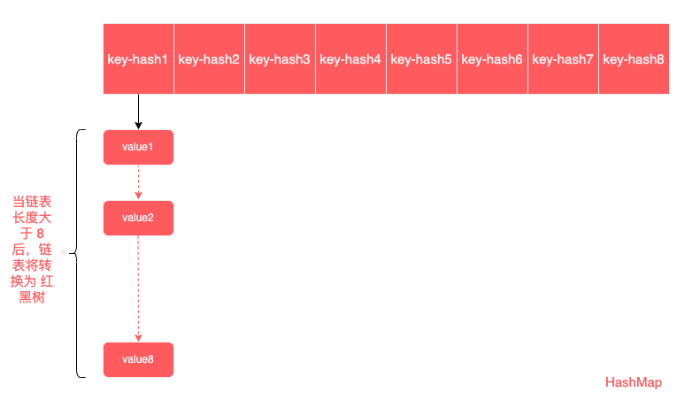

# Go Map 源码解析

在我们开始对 map 的源码进行解析前，我想先梳理一些有关 map 的额外信息，希望的是能有助于阅者们少走弯路。
* 1、基于 map 的 Go 源码版本路径差异：
* * 1.1、Go1.10 及 以下版本的 map 源码路径：src/runtime/hashmap.go
* * 1.2、Go1.11 及 以上版本（目前截止到 Go1.23）的 map 源码路径：src/runtime/map.go
* 2、map 的 make 初始化创建的底层源码实现，是有两套方案：
* * 2.1、小容量 map 的初始化：func makemap_small() *hmap
* * 2.2、大容量 map 的初始化：func makemap(t *maptype, hint int, h *hmap) *hmap

***Now that the digression is over, let’s get back to the point.***

## map 的数据结构
说起 map 这个概念，那就不得不提起国内版本中永远的“八股文之王”了，java 的 HashMap(jdK8)。虽说 java 因为 Oracle 的付费操作，而让国内的玩家们长期停滞于 JDK8 的版本。但我们也不得不承认，HashMap 的底层设计堪称一代经典之作。如果你已经有了对 HashMap 的了解，那么关于 Go map 的设计理念将会更容易去理解。没有也无妨，我们简单描述一下 HashMap 的数据结构，也算为 Go map 做个铺垫。

HashMap(jdk8) 图解



* HashMap，它是以 key-value 的方式进行数据存储，在底层的构成上，是基于 数组+链表 的方式来实现；
* 存储上，根据 key 进行一个哈希运算，从而得到一个关于 key 的 hash值。通过这个 hash值 来定位 key-value 在数组上的存储位置。理想情况下，自然是一个 hash值 只占一个位置。但现实往往是不遂人员的，哈希运算的结果不可避免的在大数据压力下会造成重复的 hash值，这样的结果就是，虽然 key 不一致，但运算后的 hash值 却是一样的，这样就会造成过失性的数据覆盖，也就是我们常说的 哈希冲突；
* 所以为了容错这一不可避免的 哈希冲突，在 map 中，key 的 hash值 相同时，会在对应的位置，延伸出一个 链表，用于存储 相同 hash值 的不同 key-value；
* other：从 java8 开始，当链表长度超过一定阈值( 链表长度大于 8 )时，会转换为 红黑树，用以提高性能。
---
在简单梳理了一下 HashMap 的设计想法后，我们可以简单地总结一下有关 map 的组成模块
* 1、存储数据的方式：key-value
* 2、用于定位底层存储位置的标识，哈希值，将 key 进行哈希运算而得到；
* 3、底层的数据结构组成：
* * 3.1、在没有 hash 冲突的理想情况下，就是一个 数组，也可以说是一个 哈希表；
* * 3.2、在存在 hash 冲突的现实情况下，数组 + 链表(或任意存储模块，只要能存放值，理论上都可以)；
---
基于上述简单总结，我们终于是可以打开源码的文件了，/src/runtime/map.go (当前 Go1.20 版本)

而在打开源码后，我们要做的第一步，并不是马不停蹄地开始阅读源码，如果你是第一次打开源码，相信我，你根本不知道从哪里开始起头阅读。而这个时候，我的建议是，从开头第一行开始，不用管它是什么，因为源码开发者就是如此地纯粹，任何源码中的存在都是具有价值的。哪怕你英文阅读不好，也不要怕，open 百度，open Google。

只要你细细阅读 map.go 的注释，你就会发现，其实关于 Go map 的设计想法，Google的大佬们早在一开始就说明了，只是 use English，而我们只需要将其翻译成中文即可。

以下为 map.go 第7行 --- 第31行的简略译文：
* map 只是一个 哈希表。数据被安排存储到一个 buckets(桶) 数组。每个 bucket 包含 8对 key/value。哈希的低位被用于选择一个 bucket，每个 bucket 都包含着 每个 哈希的几个高位，高位的意义是用于区分单个 bucket 内部的条目。
* 如果一个 bucket 中的条目超过了 8对 key/value， 我们会链接一个额外的 bucket。
* 当 哈希表扩容 时，我们会分配一个 两倍大的 新的 bucket 数组。而后将数据逐渐从 旧的bucket数组 复制到 新的bucket数组。
* Map 迭代器遍历 buckets 数组并按遍历顺序返回 key（先在 桶编号，然后是 溢出链顺序，最后是 桶内索引）。为了保持迭代语义，我们从不移动存储在桶内 keys 的位置（如果我们移动了，那么 keys 可能会返回 0 或 2 次）。当我们扩容表时，迭代器仍在旧表上进行迭代，如果他们正在遍历的桶已经被移动("evacuated")到新的哈希表中，则必须检测新的哈希表。
---
从上面的简略译文，我们也就了解到 Go map 的一个大致模型了：
* Go map 本质上是一个由 bucket 组成的 哈希表；
* 每个 bucket 最多包含 8 对 key/value;
* key 的 哈希值，分为 高位 和 低位，低位用于索引 bucket 的位置，高位用于区分 bucket内部的条目位置；
* bucket 内部超过 8对 key/value 后，额外链接一个 bucket；

是不是发现 Go map 和 HashMap 有那么一点儿相似的味道了。

而在做了这么多铺垫后，我们终于可以开始美妙的源码阅读时间了。首先让我们来看看上文中提及次数最多的一个结构体，bucket 
```go
// A bucket for a Go map.
type bmap struct {
	// tophash generally contains the top byte of the hash value
	// for each key in this bucket. If tophash[0] < minTopHash,
	// tophash[0] is a bucket evacuation state instead.
    /* 
    译文：
        tophash 通常情况下，存储了 bucket 中每个 key 的哈希值的 高字节(top byte)。
        如果 tophash[0] < minTopHash，则 tophash[0] 表示这个桶正处于迁移(evacuation)状态
    */
	tophash [bucketCnt]uint8
	// Followed by bucketCnt keys and then bucketCnt elems.
	// NOTE: packing all the keys together and then all the elems together makes the
	// code a bit more complicated than alternating key/elem/key/elem/... but it allows
	// us to eliminate padding which would be needed for, e.g., map[int64]int8.
	// Followed by an overflow pointer.
    /* 
    译文：
        再接着，bucketCnt 个 keys，然后是 bucketCnt 个 elems。
        笔记：将所有 keys 打包放一起，然后把所有 elems 放一起。这样做的话，虽然使得代码比起交替 key/elem/key/elem/... 更为复杂。
            但它能消除因内存对齐需求而产生的填充空间，从而更高效地利用内存。例如：map[int64]int8。
        再接着是一个 overflow(溢出桶) 指针。
    */
}
```